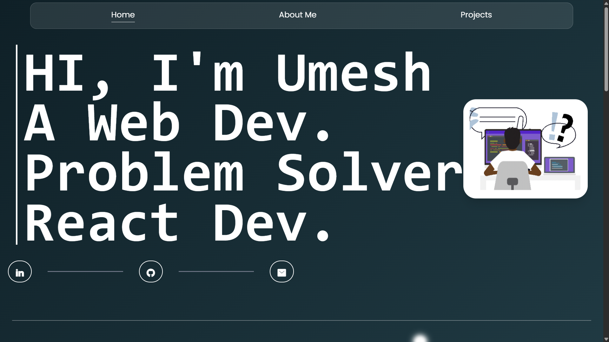

# Umesh Tummepalli – Web Developer Portfolio

A modern, responsive portfolio website showcasing my skills, projects, and experience as a front-end developer.

## 🚀 Live Demo

👉 [umeshportfolio-beryl.vercel.app](https://umeshportfolio-beryl.vercel.app/)

## 📸 Preview


*Home page of the portfolio*

## 🛠️ Tech Stack

* **Frontend:** React.js, HTML5, CSS3 , GSAP , TailwindCSS
* **Deployment:** Vercel

## 📁 Features

* Responsive design compatible with all devices
* Showcases personal projects with descriptions and links
* Includes an "About Me" section detailing skills and experience
* Clean and intuitive user interface

## 🧰 Getting Started

To run this project locally:

1. **Clone the repository:**

   ```bash
   git clone https://github.com/Umesh-Tummepalli/Portfolio.git
   cd Portfolio
   ```


2. **Install dependencies:**

   ```bash
   npm install
   ```


3. **Start the development server:**

   ```bash
   npm run dev
   ```


4. **Open in browser:**

   Navigate to `http://localhost:5173` to view the application.

## 📦 Deployment

The portfolio is deployed using [Vercel](https://vercel.com/).


## 📚 Learnings

* Enhanced proficiency in React.js .
* Learned best practices for deploying applications with Vercel
## 📬 Contact

Feel free to reach out:

* **Email:** [umeshtummepallioff3@gmail.com](mailto:your.umeshtummepallioff3@gmial.com)
* **LinkedIn:** [https://www.linkedin.com/in/umesh-tummepalli-924362333/](https://www.linkedin.com/in/umesh-tummepalli-924362333/)
* **GitHub:** [https://github.com/Umesh-Tummepalli](https://github.com/Umesh-Tummepalli)


